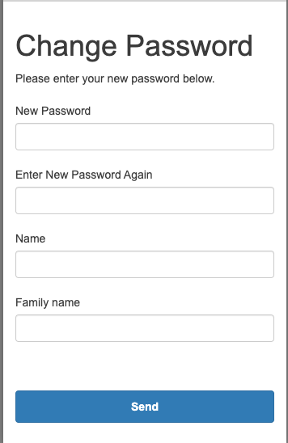

This playbook explains how to register and invite new users to the app when using AWS Cognito with self-registration disabled.

## Prerequisites

1. AWS account configured with the correct permissions
2. Familiarity with the app's Cognito User Pool configuration.
3. The user's details (email) to register them.

## Register a new user

1. Log in to the [AWS Management Console][ott-aws-login].
2. Go to **Amazon Cognito**.
3. Select the **User Pool** associated with the app - `commodi-tea-user-pool`.
4. In the left-hand menu, click **User management → Users**.
5. Click **Create user**.
6. Fill in the details:
  - **Invitation message**: Tick on the ***Send an email invitation*** option.
  - **Email address**: Enter the user’s email and tick ***Mark email address as verified***.
  - **Temporary password**: Tick on the ***Generate a password***.

7. Click **Create user**.

AWS Cognito will automatically send an invitation email to the user with their login details.

[ott-aws-login]: https://eu-west-2.signin.aws/platform/login?workflowStateHandle=db3ab5ba-1272-4297-a9c4-22662bce09c4

## Invitation email

The email includes:

- A link to the app.
- The user’s username (their email address).
- A temporary password.
- Instructions to reset their password during the first login.

Example email:

> Subject: Your New "Commodi-Tea" Account
>
> Body:
> You have been invited to access Commodi-Tea. Please use the > following details to log in and set up your account:
>
> - Username: [email].
> - Temporary Password: [temporary_password].
>
> This invitation expires in 7 days.
>
> You will be asked to provide your name and set up a new password as part of the setup process.
> For security reasons, please do not share these details with anyone.
>
> If you require assistance, you may contact us at hmrc-trade-tariff-support-g@digital.hmrc.gov.uk.
>
> Best regards,
> OTT Digital Support

**Note:** Changes to the invitation message need to be done in the Terraform code.

## User first login

1. The user logs in using the temporary credentials.
2. They are prompted to reset their password.

3. After resetting the password, they can access the app.

## Automate user registration (optional)

If you need to register users frequently, use the `AWS CLI` to automate the process.

**Example CLI command**
> aws cognito-idp admin-create-user \
  --user-pool-id `your_user_pool_id`\
  --username `user_email` \
  --temporary-password `temporary_password` \
  --user-attributes Name=email,Value=`user_email`

Replace:

- `your_user_pool_id`: Your Cognito User Pool ID.
- `user_email`: The user’s email address.
- `temporary_password`: A temporary password.

## How it works

- **AWS Cognito**: Manages user authentication and sends the invitation email.
- **Self-registration disabled**: Users cannot sign up themselves; they must be registered by the development team.
- **Temporary passwords**: Users must reset their password during the first login for security.

## Troubleshooting

- **User cannot log in**: Check if the user is confirmed in the Cognito User Pool.
- **Email not sent**: Verify the email address and Cognito’s email settings.
- **Password reset issues**: Ensure the user follows the correct reset flow.
